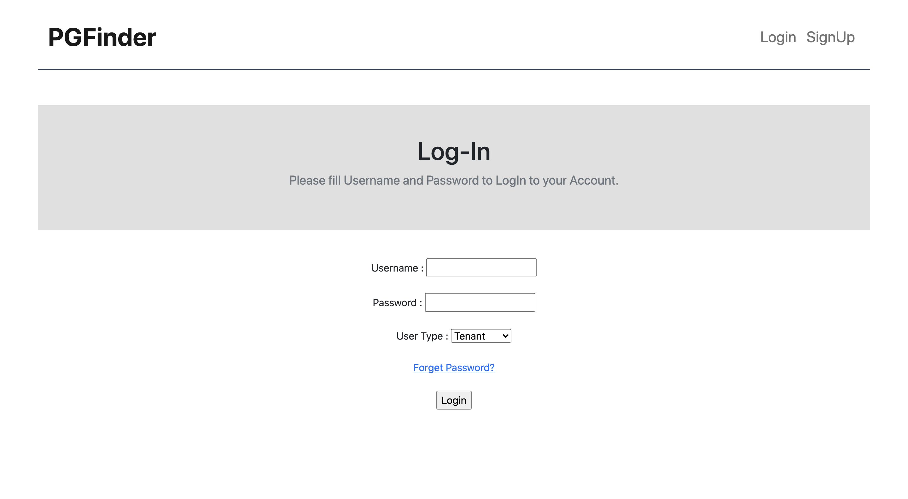
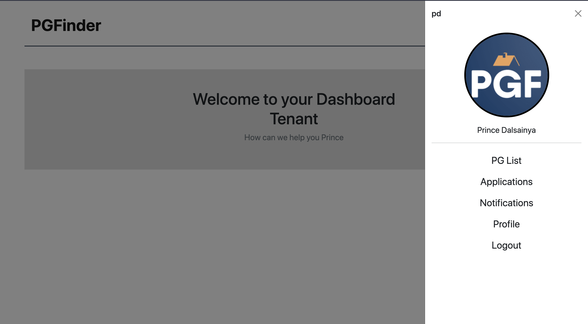
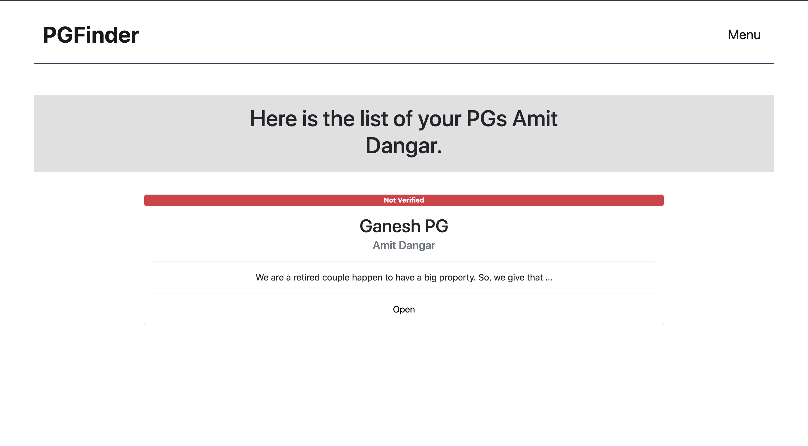
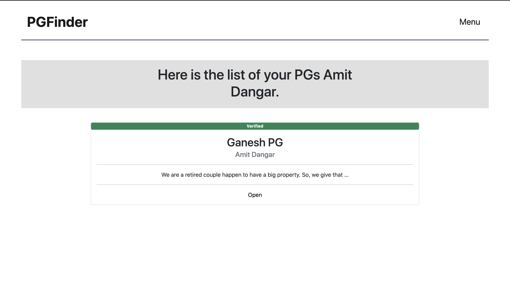
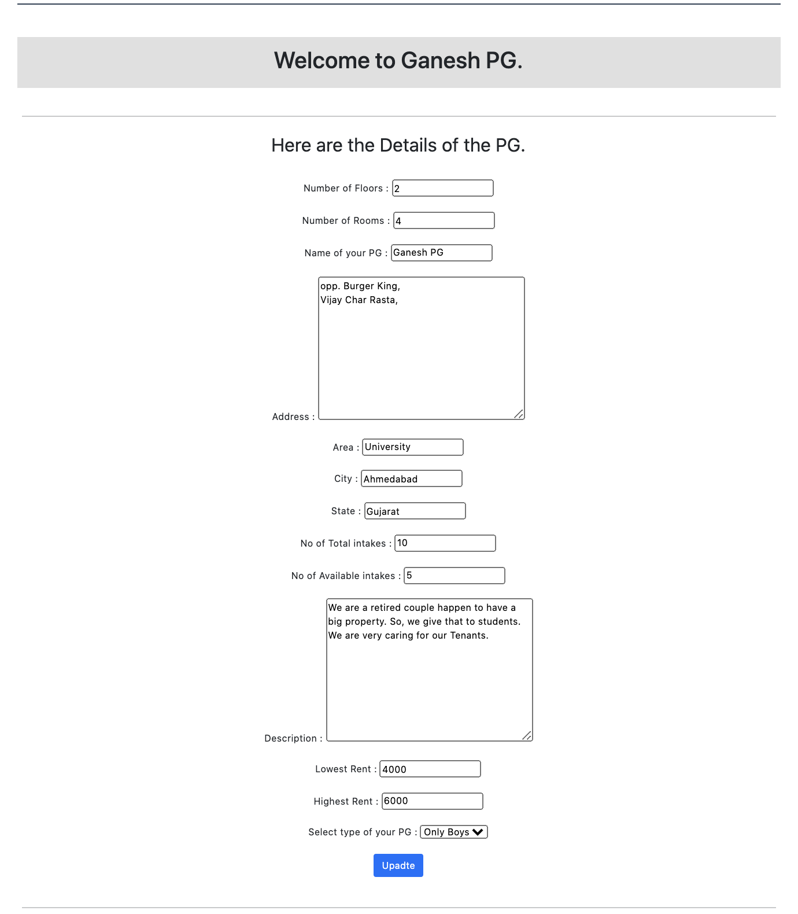
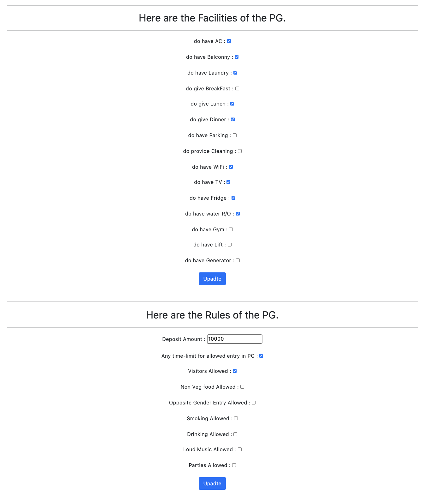
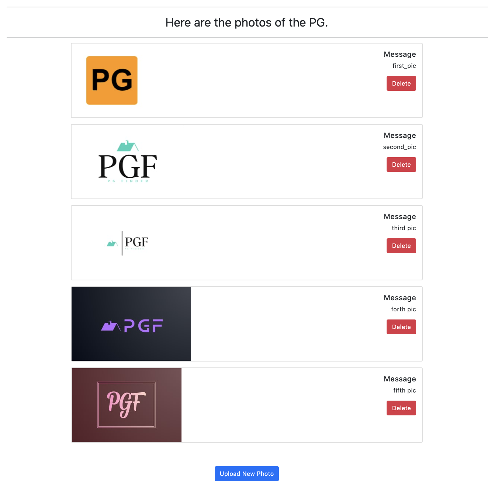

# PGF (PG Finder)

This website is part of the event **WMC(Website Making Challenge)** at my University. I have made this website for just fun, and to try out new things in Django, and so some experiments with it. And to improve my Django Skills.

This project was built in hurry, and more of a backend centric project. So, I haven't focused on the **Frontend** part. I have just straight away used **Bootstrap**. 

## New Things I have Tried.

* **Email Verification**
	> When a user tries to SignUp to the site, they have to give email. We send an **Activation Link** of the account. Only after that they can login to their accounts. 

* **Cloudinary**
	> This is an **Google Drive** like Cloud service. Which offers **25GB** of space to use for free. Where we can Upload or Retrieve assets (image, video, etc). This was the first time I have used online static files container. This was my first close to real world development experience.
	

## User Roles on this site.
*  **Tenant** (Who is finding the PG)
*  **Owner** (Who wants to give their PG on rent)
*  **Admin** (Who manages which PGs to show)

## Functional Requirements of Each Role.

1. **Tenant** :
	* They can see the list of the PGs available.
	* They can filter the PGs according to their choice (Facilities, Location, Rent, etc.)
	* They can apply to any PG of their choice. Also they can see the status of their Application.
	
2. **Owner** :
	* They can see the PGs they have registered. Also edit the details whenever they want.
	*  They can register their PG. On the time of registration, they should be able to add details like Name, Location, Min-Max Rent, Floors and Rooms they have, Available vacancies, Photos of their PG, Facilities, Rules, etc.
	* They can see the applications got from the Tenant and Approve or Reject them.
	*  They can see the status of approval for their PG.

3. **Admin** :
	* Admin can manage which PGs will be visible to Tenant.
	* Admin can Approve or Reject the new PG application got from the Owner.
	* Admin can toggle the visibility of any PG to Tenants at any time.
	
## Now let's have a look at Screen Shots of some screens.

* **Login**
 

* **Dashboard**

* **PG-List with non-approved PG**

* **PG-List with approved PG**

* **PG details**

* **PG Facilities and Rules**

* **PG Photos**

